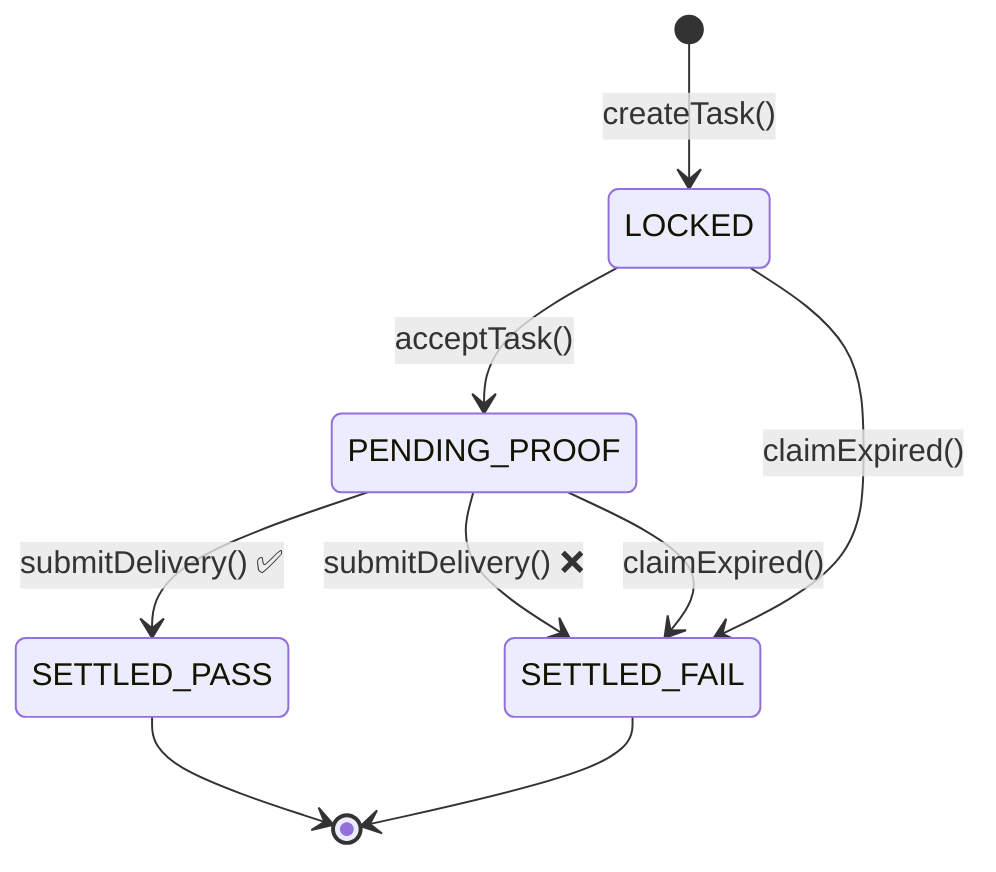

# AgentOS — Product Requirements Document v3.0

**Conditional Payment Escrow (CPE) for Autonomous AI Agents**

---

## 1. Executive Summary

AgentOS introduces a **Conditional Payment Escrow (CPE)** protocol that allows autonomous AI agents to transact with each other using verifiable, on-chain conditions. Unlike direct payment models where funds are irrevocably sent, CPE locks USDC in a smart contract and releases payment only when the Research Agent's delivery meets predefined conditions — evaluated entirely on-chain, with no oracle, no human approval, and no central coordinator.

The system consists of two agent roles:

- **Personal Agent** — Creates tasks, locks USDC, defines verifiable conditions
- **Research Agent** — Discovers tasks, executes work, submits proof of delivery

Settlement is **atomic**: evaluation + payment happen in a single transaction, ensuring neither party can be defrauded.

---

## 2. Problem Statement

Current AI agent payment infrastructure has a fundamental trust problem:

- **Direct payment (x402 standard)** transfers USDC irrevocably before the agent produces output. If the output is garbage, the payer has no recourse.
- **Human-in-the-loop review** doesn't scale and defeats the purpose of autonomous agent-to-agent transactions.
- **Off-chain escrow** requires a trusted third party, adding a centralization risk.

AgentOS solves this by moving condition evaluation on-chain, making the smart contract itself the impartial judge.

---

## 3. Target Users

| User Type | Description |
|-----------|-------------|
| **Hackathon Judges** | Primary audience for Avalanche Summit demo. Need to see the full lifecycle in under 3 minutes. |
| **AI Agent Developers** | Builders who want to integrate conditional payments into their agent workflows. |
| **DeFi Protocol Teams** | Teams exploring agent-to-agent payment infrastructure. |
| **Avalanche Ecosystem** | Projects evaluating Fuji/C-Chain for agent-native applications. |

---

## 4. Core Feature Requirements

### 4.1 Smart Contracts (Solidity)

| ID | Feature | Priority | Description |
|----|---------|----------|-------------|
| SC-01 | CPE Contract | P0 | Main escrow contract with `createTask()`, `acceptTask()`, `submitDelivery()`, `claimExpired()` |
| SC-02 | Condition Engine | P0 | On-chain evaluation of `FORMAT_JSON`, `FIELD_EXISTS`, `VALUE_THRESHOLD` |
| SC-03 | ERC-8004 Integration | P0 | Agent identity registry with trust scores and capability verification |
| SC-04 | USDC SafeTransfer | P0 | Use OpenZeppelin SafeERC20 for all token movements |
| SC-05 | ReentrancyGuard | P0 | Protect all external functions that move funds |
| SC-06 | Event Emission | P0 | `TaskCreated`, `TaskAccepted`, `DeliverySubmitted`, `TaskSettled` events |

### 4.2 Agent Scripts (JavaScript/Ethers.js)

| ID | Feature | Priority | Description |
|----|---------|----------|-------------|
| AG-01 | Personal Agent | P0 | `createTask()`, `monitorTask()`, `listenForSettlement()` |
| AG-02 | Research Agent | P0 | `discoverTasks()`, `checkIdentity()`, `acceptTask()`, `submitDelivery()` |
| AG-03 | Proof Builder | P0 | `buildProofData()` for all 3 condition types |
| AG-04 | Demo Path A | P0 | Successful delivery — USDC released to Research Agent |
| AG-05 | Demo Path B | P0 | Failed delivery — USDC returned to Personal Agent |

### 4.3 Dashboard (Next.js)

| ID | Feature | Priority | Description |
|----|---------|----------|-------------|
| UI-01 | Task Timeline | P0 | Visual pipeline showing `LOCKED → PENDING_PROOF → SETTLED` |
| UI-02 | Condition Builder | P0 | Form to create tasks with condition type, field name, threshold |
| UI-03 | Wallet Connection | P0 | MetaMask integration for signing transactions |
| UI-04 | Live Status | P0 | Real-time task status polling from CPE contract |
| UI-05 | Settlement View | P1 | Show PASS/FAIL outcome with Snowtrace links |
| UI-06 | Agent Identity | P1 | Display ERC-8004 trust scores and capabilities |

---

## 5. Technical Architecture

### 5.1 System Components

```
┌──────────────────┐                ┌─────────────────┐
│  Personal Agent  │                │  Research Agent  │
│ (MetaMask signer)│                │ (Hardhat wallet) │
└──────┬───────────┘                └────────┬────────┘
       │                                     │
       │ createTask()              acceptTask()│
       │ approve()             submitDelivery()│
       ▼                                     ▼
┌────────────────────────────────────────────────────┐
│         Conditional Payment Escrow (CPE)           │
│                                                    │
│   ┌──────────────────────────────────────────┐     │
│   │        USDC Locked in Contract           │     │
│   └──────────────────────────────────────────┘     │
│                                                    │
│       _evaluateCondition() → _settle()             │
└──────────────────────┬─────────────────────────────┘
                       │
                       │ updateReputation()
                       ▼
┌────────────────────────────────────────────────────┐
│           ERC-8004 Agent Registry                  │
│          Trust Scores + Capabilities               │
└────────────────────────────────────────────────────┘
```

### 5.2 Contract Deployment Order

1. Deploy `MockERC8004` (agent registry)
2. Deploy `ConditionalPaymentEscrow(usdcAddress, erc8004Address)`
3. Call `erc8004.setCPEContract(cpeAddress)`
4. Call `erc8004.registerAgent()` for both agents
5. Run demo paths A and B

---

## 6. Condition Types

| Type | Enum | Evaluation Logic | Use Case |
|------|------|-----------------|----------|
| `FORMAT_JSON` | 0 | `proofData[0] == '{'` && `proofData[last] == '}'` | Verify output is structured JSON |
| `FIELD_EXISTS` | 1 | ABI-decode `bool` from proofData | Verify specific field present in output |
| `VALUE_THRESHOLD` | 2 | ABI-decode `uint256`, check `>= threshold` | Verify minimum result count |

---

## 7. Task Lifecycle States

| State | Enum | Trigger | Next State |
|-------|------|---------|------------|
| `LOCKED` | 0 | `createTask()` | `PENDING_PROOF` or `SETTLED_FAIL` (expired) |
| `PENDING_PROOF` | 1 | `acceptTask()` | `SETTLED_PASS` or `SETTLED_FAIL` |
| `SETTLED_PASS` | 2 | `submitDelivery()` (condition met) | Terminal |
| `SETTLED_FAIL` | 3 | `submitDelivery()` (condition failed) or `claimExpired()` | Terminal |



---

## 8. Demo Scenarios

### 8.1 Path A — Successful Delivery

| Property | Value |
|----------|-------|
| **Condition** | `VALUE_THRESHOLD` (`yield_opportunities >= 3`) |
| **Amount** | 0.5 USDC |
| **Output** | `{ yield_opportunities: [{Benqi, 6.2%}, {GoGoPool, 8.1%}, {AAVE, 4.8%}] }` |
| **Result** | ✅ PASS → USDC released to Research Agent, trust score +1 |

### 8.2 Path B — Failed Delivery (Auto-Refund)

| Property | Value |
|----------|-------|
| **Condition** | `FORMAT_JSON` |
| **Amount** | 0.5 USDC |
| **Output** | `"Here are some yields: AVAX is good."` (plain text) |
| **Result** | ❌ FAIL → USDC returned to Personal Agent, trust score -1 |

---

## 9. Non-Functional Requirements

| Category | Requirement |
|----------|-------------|
| **Gas Efficiency** | `createTask` < 200k gas, `submitDelivery` < 150k gas |
| **Security** | `ReentrancyGuard` on all fund-moving functions |
| **Testability** | 100% path coverage with Hardhat tests |
| **Deadline** | Deploy-ready for Avalanche Summit hackathon |
| **Chain** | Avalanche Fuji C-Chain (testnet, chainId `43113`) |
| **Token** | USDC (6 decimals) at `0x5425890298aed601595a70AB815c96711a31Bc65` |

---

## 10. Success Metrics

| Metric | Target |
|--------|--------|
| Demo Path A completes | < 60 seconds end-to-end |
| Demo Path B completes | < 60 seconds end-to-end |
| All Hardhat tests pass | 27/27 (100%) |
| Dashboard loads with live data | < 3 seconds |
| Trust score updates on-chain | Verified via Snowtrace |

---

## 11. Out of Scope (v3.0)

- Multi-agent task bidding
- IPFS/Arweave storage for deliverables
- Cross-chain escrow
- Production mainnet deployment
- Advanced condition types (ML model validation, multi-signature)
- Agent-to-agent message passing (all coordination is on-chain via CPE)

---

## 12. Open Questions

1. Should `FIELD_EXISTS` use on-chain JSON parsing instead of self-attestation?
2. Should there be a minimum trust score to accept tasks?
3. Should the CPE contract be upgradeable (proxy pattern)?
4. Should we add a dispute resolution mechanism for v4.0?

> [!NOTE]
> Questions 1 and 2 have been addressed in the security audit:
> - **Q1**: `FIELD_EXISTS` remains self-attested but now has an explicit `@dev SECURITY NOTE` documenting the trade-off.
> - **Q2**: A configurable `minTrustScore` + `setMinTrustScore()` has been added to the CPE contract.

---

## Document Version History

| Version | Date | Changes |
|---------|------|---------|
| v1.0 | 2025-01-15 | Initial PRD with basic escrow concept |
| v2.0 | 2025-03-20 | Added ERC-8004 integration, 3 condition types |
| v3.0 | 2025-06-10 | Added dashboard requirements, demo scenarios, deployment order |
